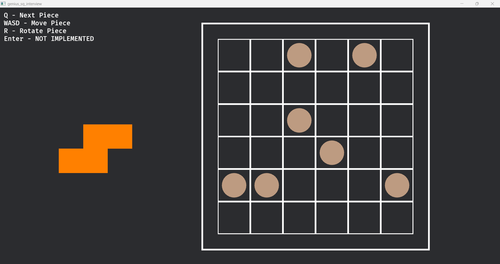

# Genius Square Interview
For this interview, I have been tasked with creating some sort of simulation or game using Rust's bevy game engine. I will implementing the game "genius square." In this game, you have a 6x6 grid and each player must race to fit all of the pieces onto the board.

## Rules:
- First, a player rolls dice to designate the locations of "blockers." These wooden circular tiles block individual locations in the grid and players must work around them to succeed.
- The game starts once the blockers are in place and players may begin placing the game pieces in any order/position/orientation they see fit. Game pieces must fit within the bounds of the grid and cannot overlap with other pieces or blockers.
- A player wins if they are the first to fit each of the pieces on the board.

## End point
Unfortunately, I was unable to complete the full game in the the allotted time. This was fairly expected so I decided to find a good stopping point. I have been able to create the board, pieces, blockers. Pieces can be rotated and moved but cannot snap to the board. Most of the building blocks of this app works except for the gameplay itself: a notion of winning, placing pieces on the board, piece/blocker/out-of-bounds collisions to prevent illegal placement, etc.

## Running the app
Simply clone the repo and run `cargo run`

## Demonstrations
### Board

### Playing
[Game Demonstration](misc/genius_sq_demonstration.mp4)

## Inspiration
A few months ago, I decided to implement the solution for this game in python but never tried to visualize it. I figured using this project as a starting point would allow me to get further along since much of the math was already implemented including piece shapes, attributes, etc. Since the focus of this interview is the visualization, it turns out that my prior code didn't help all that much. But I'd like to link it here for the sake of transparency:
[Initial Genius Sq Implementation](https://github.com/dlerner97/genius_sq_impl.git)